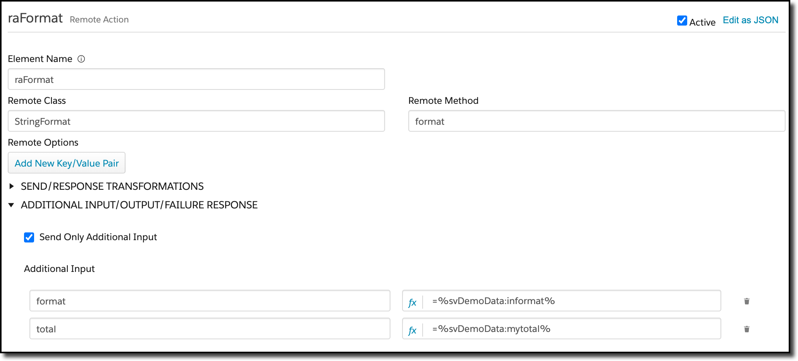

# Formatter
An Apex formatter class that can be called from integration procedures or omniscripts

## Installation

The class StringFormat.cls needs to be added to your org.  You may have to change the Vlocity namespace in line 1.

## Use

Call it as a remote action.  The input parameter contains the format string.  Other parameters can be passed and referred to in the format string.

The format string is copied as is to the output with the following exceptions:

* The \ character is used to escape the next character (useful for another \, $, or {})
* The $ character is replaced with the user's currency symbol (e.g, €)
* The { character starts a variable substitution (which is ended by another })

The variable substitution has the following format:

{*name*:*format*}

The name is the name of an input variable to be substituted

The format string starts with a letter to indicate the type of formatting, followed by any arguments.  Currently (it's early days), the only formats are:

| Format | Args    | Function                                                     |
| ------ | ------- | ------------------------------------------------------------ |
| s      | *none*  | Copy the variable literally into the string                  |
| u      | *none*  | Uppercase the variable                                       |
| l      | *none*  | Lowercase the variable                                       |
| d      | *digit* | Format the variable as a number with *digit* decimal places.  Uses the locale of the user to control thousands separators and decimal point. |

### Example

This repository includes a simple test integration procedure to exercise the class.  It does two things, really.

First, it sets some values to be passed into the class:

Then, the values are passed to the method:

And the results come back:

(The locale here is Germany as a test of the locale)

